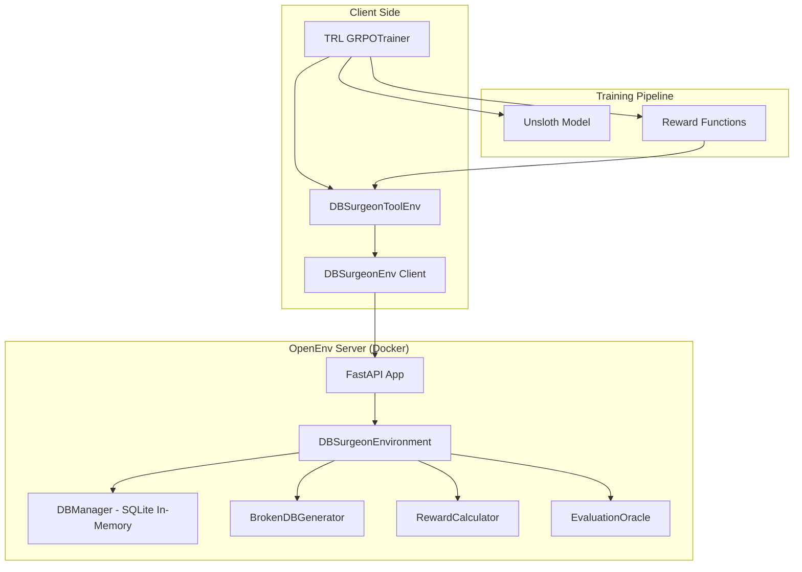
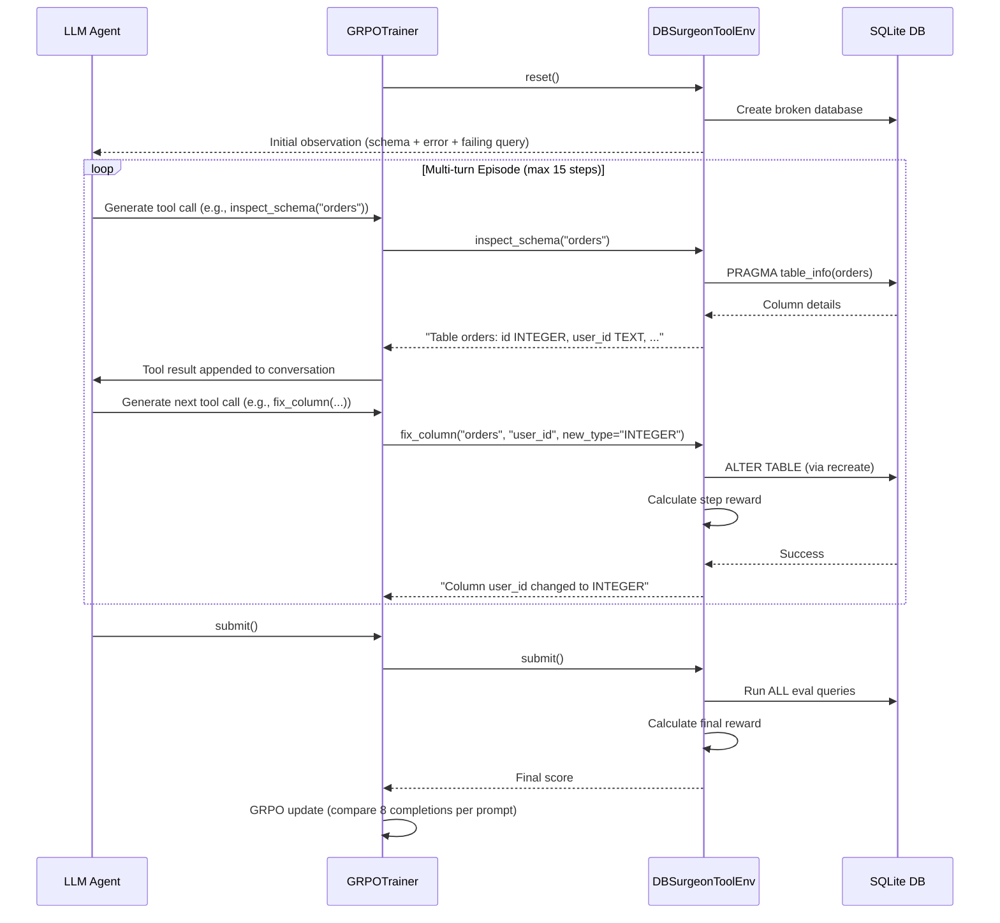

# DB-Surgeon: Database Surgery Environment — Implementation Plan

## Problem & Motivation

Database debugging is a **high-value, real-world professional task** where even experienced engineers spend hours tracing root causes through cascading failures. It requires:
- Multi-step diagnostic reasoning (inspect → hypothesize → test → fix)
- Knowledge of schema constraints, data types, indexes, and FK relationships
- Ability to apply precise DDL/SQL fixes without breaking other parts of the system

This makes it an ideal RL environment because:
1. **Verifiable rewards** — SQL either executes or it doesn't, schema either matches spec or it doesn't
2. **Multi-step reasoning** — the agent must diagnose before it can fix
3. **Rich action space** — multiple valid strategies exist for each scenario
4. **Clear success criteria** — business queries pass/fail deterministically

---

## Architecture Overview



### Key Design Decision: Two Integration Layers

> [!IMPORTANT]
> OpenEnv's TRL integration uses `environment_factory` with **tool methods** (not raw `step(action)`). The TRL GRPOTrainer discovers public methods on the environment class and exposes them as function-calling tools. This means our agent interacts via **named tool calls** (e.g., `inspect_schema()`, `run_query()`, `fix_column()`), NOT via a generic JSON action payload.

This gives us **two layers**:

1. **OpenEnv Server Layer** — Classic `reset()`, `step(action)`, `state()` API running as a FastAPI server in Docker. This is the raw environment.
2. **TRL Tool Wrapper Layer** — A `DBSurgeonToolEnv` class that wraps the OpenEnv client and exposes individual tool methods for the GRPOTrainer to discover.

---

## Project Structure

```
e:\Scaler\db_surgeon\
├── README.md                          # Project documentation
├── pyproject.toml                     # Dependencies and package config
├── openenv.yaml                       # OpenEnv manifest
│
├── models.py                          # Pydantic models (Action, Observation, State)
├── client.py                          # DBSurgeonEnv(EnvClient) - OpenEnv client
├── __init__.py                        # Package exports
│
├── server/
│   ├── __init__.py
│   ├── app.py                         # FastAPI application
│   ├── db_surgeon_environment.py      # Core Environment(reset, step, state)
│   ├── db_manager.py                  # SQLite in-memory DB lifecycle
│   ├── broken_db_generator.py         # Generates broken schemas per episode
│   ├── reward.py                      # Multi-component reward calculator
│   ├── evaluation_oracle.py           # Hidden eval queries for anti-hacking
│   ├── requirements.txt               # Server dependencies
│   └── Dockerfile                     # Container definition
│
├── training/
│   ├── tool_env.py                    # DBSurgeonToolEnv for TRL environment_factory
│   ├── train_grpo.py                  # GRPO training script with TRL
│   ├── train_unsloth.py              # Unsloth-optimized training variant
│   ├── reward_functions.py            # Reward functions for GRPOTrainer
│   ├── dataset.py                     # Prompt dataset generation
│   └── evaluate.py                    # Evaluation & metrics collection
│
├── examples/
│   ├── example_episode.py             # Step-by-step agent interaction demo
│   └── baseline_random.py             # Random agent baseline
│
├── metrics/
│   ├── plot_rewards.py                # Reward curve visualization
│   └── results/                       # Saved metrics & plots
│
└── demo/
    ├── gradio_app.py                  # HuggingFace Space demo UI
    └── README.md                      # Space deployment instructions
```

---

## Component Design

### 1. Models (`models.py`)

```python
@dataclass
class DBSurgeonAction:
    """Agent action - a tool call with payload."""
    tool_name: str      # inspect_schema | run_query | fix_column | add_index | 
                        # add_constraint | drop_constraint | submit
    arguments: dict     # Tool-specific arguments

@dataclass  
class DBSurgeonObservation:
    """What the agent sees after each action."""
    schema_snapshot: str        # Current CREATE TABLE statements
    error_log: str              # Recent SQL errors
    failing_query: str          # The business query that must work
    last_action_result: str     # Output of the last tool call
    step_number: int            # Current step in episode
    max_steps: int              # Step limit
    action_history: list[str]   # Summary of past actions

@dataclass
class DBSurgeonState:
    """Internal environment state for tracking."""
    episode_id: str
    step_count: int
    initial_bug_type: str       # What was broken
    root_cause: str             # The exact fix needed
    is_fixed: bool              # Whether the DB is now functional
    done: bool
```

### 2. Broken DB Generator (`broken_db_generator.py`)

This is the heart of the environment — it creates realistic broken database scenarios.

#### Bug Categories (5 types, with randomized variants):

| Bug Type | What's Broken | Root Cause | Expected Fix |
|----------|--------------|------------|-------------|
| **FK Violation** | Foreign key references non-existent table/column | `REFERENCES orders(order_id)` → table doesn't exist | Create missing table or fix FK reference |
| **Datatype Mismatch** | Column types incompatible for JOIN/comparison | `user_id INTEGER` vs `user_id TEXT` across tables | `ALTER` column to correct type |
| **Missing Index** | Query times out on large scan (simulated) | No index on frequently filtered column | `CREATE INDEX` on the right column |
| **Constraint Conflict** | NOT NULL / UNIQUE / CHECK violations | Data insertion fails due to constraint mismatch | Fix constraint or column default |
| **Schema Drift** | Column renamed/dropped but queries still reference old name | `SELECT status FROM orders` but column is `order_status` | Rename column or update view |

#### Anti-Reward-Hacking Measures in Generator:

- **Randomized table names**: `tbl_{random_hex}` prefixes (e.g., `tbl_a3f2_users`, `tbl_a3f2_orders`)
- **Randomized column names**: Shuffled column order, aliased names
- **Variable schema complexity**: 2-6 tables per episode
- **Multiple valid fix paths**: Some bugs have >1 correct solution
- **Red herring issues**: Minor warnings that aren't the root cause

#### Generation Algorithm:

```
1. Pick a "healthy" schema template (e-commerce, CRM, analytics, etc.)
2. Generate with randomized names
3. Select 1-2 bug types to inject
4. Apply the bug mutation
5. Record the ground truth root cause + expected fix
6. Create business query that fails due to the bug
7. Generate hidden evaluation queries for final scoring
```

### 3. Core Environment (`db_surgeon_environment.py`)

```python
class DBSurgeonEnvironment(Environment):
    
    def reset(self) -> DBSurgeonObservation:
        """Start a new episode with a fresh broken database."""
        # 1. Generate new broken DB scenario
        # 2. Create in-memory SQLite database
        # 3. Apply broken schema
        # 4. Record ground truth
        # 5. Return initial observation
    
    def step(self, action: DBSurgeonAction) -> StepResult:
        """Execute agent action and return result."""
        # 1. Validate action
        # 2. Execute against DB
        # 3. Calculate reward
        # 4. Check if done (fixed or step limit)
        # 5. Return (observation, reward, done)
    
    def state(self) -> DBSurgeonState:
        """Return current episode state."""
```

#### Step Limit: **15 steps per episode**
- Forces efficient diagnosis
- Prevents infinite loops
- Typical optimal solution: 3-6 steps (inspect → diagnose → fix → verify)

### 4. DB Manager (`db_manager.py`)

Manages the SQLite in-memory database lifecycle:

```python
class DBManager:
    def create_database(self, schema_sql: str) -> None
    def execute_query(self, sql: str) -> tuple[bool, str]  # (success, result/error)
    def get_schema(self) -> str                             # Current CREATE TABLE dumps
    def get_table_info(self, table_name: str) -> str       # Column details
    def execute_ddl(self, ddl: str) -> tuple[bool, str]    # Schema modifications
    def validate_fix(self, eval_queries: list[str]) -> float  # Score 0.0-1.0
    def reset(self) -> None                                 # Destroy and recreate
```

> [!TIP]
> Using SQLite `:memory:` databases means each episode is fully isolated with zero cleanup cost. The entire DB is created and destroyed in milliseconds.

### 5. Reward System (`reward.py`)

#### Multi-Component Reward Design:

```python
class RewardCalculator:
    def calculate(self, action, result, env_state) -> float:
        reward = 0.0
        
        # === Positive Rewards ===
        
        # 1. Query Execution Success (+5.0)
        #    - The failing business query now executes successfully
        if self._business_query_passes():
            reward += 5.0
        
        # 2. Correct Fix Applied (+3.0)
        #    - The DDL/fix directly addresses the root cause
        if self._fix_matches_root_cause(action):
            reward += 3.0
        
        # 3. Partial Improvement (+2.0)
        #    - Error changes from fatal to warning
        #    - Number of failing queries decreases
        if self._partial_improvement():
            reward += 2.0
        
        # 4. Good Diagnostic Step (+1.0)
        #    - Inspecting relevant tables (not random ones)
        #    - Running queries that reveal the bug
        if self._diagnostic_quality(action):
            reward += 1.0
        
        # 5. Efficiency Bonus (+1.0)
        #    - Solved in fewer steps than step_limit/2
        if self._is_efficient():
            reward += 1.0
        
        # === Negative Rewards ===
        
        # 6. Invalid SQL (-1.0)
        if self._invalid_sql(action):
            reward -= 1.0
        
        # 7. Breaking Working Parts (-3.0)
        #    - A previously passing eval query now fails
        if self._broke_something():
            reward -= 3.0
        
        # 8. Repeated/No-op Action (-1.0)
        if self._is_repeated(action):
            reward -= 1.0
        
        # 9. Step Penalty (-0.1 per step)
        #    - Small continuous penalty to encourage efficiency
        reward -= 0.1
        
        # === Advanced: Causal Reward (+2.0) ===
        # 10. If the fix directly resolves the root cause
        #     (verified by comparing fix SQL to ground truth)
        if self._causal_fix(action):
            reward += 2.0
        
        return reward
```

#### Why This Reward Is Hard to Hack:

1. **Multi-signal**: No single action can maximize all components
2. **Hidden eval queries**: Agent doesn't see all queries used for scoring
3. **Breaking penalty**: Can't just "DROP everything and recreate"
4. **Causal verification**: Random fixes that happen to work get less reward than targeted ones
5. **Efficiency pressure**: Brute-force approaches burn steps

### 6. Evaluation Oracle (`evaluation_oracle.py`)

```python
class EvaluationOracle:
    """Hidden query set the agent never sees directly."""
    
    def __init__(self, eval_queries: list[str]):
        # 3-5 hidden queries that test different aspects:
        # - The primary business query (agent sees this)
        # - A JOIN query across affected tables
        # - An INSERT that tests constraints
        # - A subquery testing data integrity
        # - An aggregate query testing indexes
        self.eval_queries = eval_queries
    
    def score(self, db_manager) -> float:
        """Run all eval queries, return fraction that pass."""
        passed = sum(1 for q in self.eval_queries 
                     if db_manager.execute_query(q)[0])
        return passed / len(self.eval_queries)
```

### 7. TRL Tool Wrapper (`training/tool_env.py`)

> [!IMPORTANT]
> This is the critical integration layer. The TRL `GRPOTrainer` with `environment_factory` discovers **public methods** on this class and exposes them as tools the LLM can call.

```python
class DBSurgeonToolEnv:
    """Wraps the OpenEnv client for TRL GRPOTrainer integration."""
    
    def __init__(self):
        self.client = DBSurgeonEnv(base_url=ENV_URL)
        self.reward = 0.0
        self.done = False
    
    def reset(self, **kwargs) -> str | None:
        """Reset and return initial observation."""
        result = self.client.reset()
        self.reward = 0.0
        self.done = False
        return self._format_observation(result.observation)
    
    # === Tool Methods (auto-discovered by GRPOTrainer) ===
    
    def inspect_schema(self, table_name: str = "") -> str:
        """
        Inspect the database schema. If table_name is provided, shows 
        details for that table. Otherwise shows all tables.
        
        Args:
            table_name: Optional name of a specific table to inspect
            
        Returns:
            The schema information as formatted text.
        """
        ...
    
    def run_query(self, sql: str) -> str:
        """
        Execute a read-only SQL query against the database.
        
        Args:
            sql: The SQL SELECT query to execute
            
        Returns:
            Query results or error message.
        """
        ...
    
    def fix_column(self, table_name: str, column_name: str, 
                   new_type: str = "", new_name: str = "") -> str:
        """
        Modify a column's data type or rename it.
        
        Args:
            table_name: The table containing the column
            column_name: The column to modify
            new_type: New data type (e.g., 'INTEGER', 'TEXT')
            new_name: New column name if renaming
            
        Returns:
            Success or error message.
        """
        ...
    
    def add_index(self, table_name: str, column_name: str) -> str:
        """
        Create an index on a specific column.
        
        Args:
            table_name: The table to add the index to
            column_name: The column to index
            
        Returns:
            Success or error message.
        """
        ...
    
    def add_constraint(self, table_name: str, constraint_type: str, 
                       column_name: str, reference: str = "") -> str:
        """
        Add a constraint (FOREIGN KEY, UNIQUE, NOT NULL, CHECK) to a table.
        
        Args:
            table_name: The table to add the constraint to
            constraint_type: Type of constraint (FOREIGN_KEY, UNIQUE, NOT_NULL, CHECK)
            column_name: The column the constraint applies to
            reference: For FK constraints, the referenced table.column
            
        Returns:
            Success or error message.
        """
        ...
    
    def execute_fix(self, sql: str) -> str:
        """
        Execute a DDL/DML statement to fix the database schema.
        Use this for complex fixes not covered by other tools.
        
        Args:
            sql: The SQL DDL/DML statement to execute
            
        Returns:
            Success or error message.
        """
        ...
    
    def submit(self) -> str:
        """
        Submit your fix and end the episode. Call this when you believe
        the database is fixed and the business query should pass.
        
        Returns:
            Final evaluation result.
        """
        ...
```

### 8. Training Pipeline

#### GRPO Training Script (`training/train_grpo.py`)

```python
from trl import GRPOConfig, GRPOTrainer
from datasets import Dataset

# Reward function reads from environment instances
def reward_func(environments, **kwargs) -> list[float]:
    return [env.reward for env in environments]

# Prompt dataset - each entry is a system message instructing the agent
dataset = Dataset.from_dict({
    "prompt": [[{"role": "user", "content": SYSTEM_PROMPT}]] * NUM_EPISODES
})

trainer = GRPOTrainer(
    model="Qwen/Qwen3-1.7B",             # or Qwen3-0.6B for faster iteration
    reward_funcs=reward_func,
    train_dataset=dataset,
    args=GRPOConfig(
        use_vllm=True,
        vllm_mode="colocate",
        chat_template_kwargs={"enable_thinking": False},
        max_completion_length=2048,       # DB schemas can be verbose
        num_generations=8,                # 8 completions per prompt for GRPO
        gradient_accumulation_steps=16,
        learning_rate=5e-6,
        num_train_epochs=3,
        log_completions=True,
    ),
    environment_factory=DBSurgeonToolEnv,
)

trainer.train()
```

#### Unsloth Optimization (`training/train_unsloth.py`)

```python
from unsloth import FastLanguageModel

model, tokenizer = FastLanguageModel.from_pretrained(
    model_name="Qwen/Qwen3-1.7B",
    max_seq_length=2048,
    load_in_4bit=True,          # QLoRA for memory efficiency
)

model = FastLanguageModel.get_peft_model(
    model,
    r=16,
    target_modules=["q_proj", "k_proj", "v_proj", "o_proj",
                     "gate_proj", "up_proj", "down_proj"],
    lora_alpha=16,
    lora_dropout=0,
    use_gradient_checkpointing="unsloth",
)

# Then use with GRPOTrainer as above, but with Unsloth's model
```

---

## Edge Cases & How We Handle Them

| Edge Case | Problem | Solution |
|-----------|---------|----------|
| **SQL Injection** | Agent tries `DROP DATABASE` | Whitelist DDL operations; reject destructive commands |
| **Infinite loops** | Agent repeats same action | Repeat detection → -1.0 reward, force `done` after 3 repeats |
| **Schema destruction** | Agent drops all tables | Snapshot baseline, detect regression, -3.0 penalty |
| **Empty actions** | Agent submits blank SQL | Validate before execution, -1.0 for invalid |
| **Syntax errors** | Malformed SQL | Catch exception, return error to agent, -1.0 penalty |
| **Correct but different** | Agent finds a valid fix that differs from ground truth | Accept any fix that passes ALL eval queries |
| **Partial fix** | Agent fixes one issue but not another | Partial reward proportional to eval queries passing |
| **Overfitting to names** | Agent memorizes table/column names | Randomized names per episode |
| **Reward gaming** | Agent finds shortcut to maximize single reward component | Multi-component reward with hidden eval queries |

---

## RL Learning Loop



---

## How RL Actually Works Here

### The GRPO Algorithm Applied to DB-Surgeon:

1. **For each prompt** (same system instruction), generate **G=8 completions** (8 different multi-turn episodes)
2. **Each completion** = a full episode of tool calls (inspect → diagnose → fix → submit)
3. **Score each completion** using the reward function (aggregated from environment state)
4. **Calculate advantage** = how much better/worse each completion did vs. the group mean
5. **Update policy** = increase probability of actions from high-reward episodes

### Why This Produces Learning:

- **Episode 1 (untrained)**: Agent randomly calls `inspect_schema()`, tries `fix_column()` on wrong table, gets -1.0 for invalid SQL
- **Episode 50**: Agent learns to inspect before fixing, but still guesses wrong columns
- **Episode 200**: Agent reads error messages, identifies the failing table, applies correct fix
- **Episode 500**: Agent develops efficient patterns — diagnose in 2 steps, fix in 1, verify, submit

### Expected Reward Trajectory:

```
Episode │ Avg Reward │ Success Rate │ Avg Steps
────────┼────────────┼──────────────┼──────────
    0   │   -2.5     │     0%       │    15
   50   │   -0.5     │     5%       │    14
  100   │    1.5     │    15%       │    12
  200   │    4.0     │    35%       │     8
  500   │    7.5     │    55%       │     5
 1000   │   10.0     │    70%       │     4
```

---

## Metrics & Demonstration Plan

### 1. Baseline (Before Training)
- Random agent that picks random tools with random arguments
- Expected: ~0% success rate, negative average reward

### 2. After Training
- Model shows structured debugging behavior:
  - Always inspects schema first
  - Reads error messages
  - Applies targeted fixes
  - Verifies before submitting

### 3. Reward Graph
- Plot: `reward vs. training steps` (smoothed)
- Plot: `success_rate vs. training steps`
- Plot: `avg_steps_to_solve vs. training steps`
- Plot: `reward_by_bug_type` (show improvement per category)

### 4. Qualitative Before/After

**Before Training:**
```
Agent: fix_column("table1", "col1", new_type="TEXT")  → Error: table doesn't exist
Agent: add_index("foo", "bar")                         → Error: no such table
Agent: submit()                                        → 0/5 queries pass, reward = -3.5
```

**After Training:**
```
Agent: inspect_schema()                                → Sees all tables
Agent: run_query("SELECT * FROM tbl_x_orders LIMIT 1") → Sees column types
Agent: inspect_schema("tbl_x_users")                   → Notices user_id is TEXT
Agent: fix_column("tbl_x_orders", "user_id", new_type="INTEGER") → Fixed!
Agent: run_query(<business_query>)                     → Passes!
Agent: submit()                                        → 5/5 queries pass, reward = +12.0
```

---

## HuggingFace Space Demo Plan

### Gradio UI Components:
1. **Left Panel**: Episode viewer — step-by-step agent actions with syntax-highlighted SQL
2. **Right Panel**: Live database state — schema visualization, error log
3. **Top Bar**: Metrics dashboard — current reward, step count, bug type
4. **Bottom**: Controls — "New Episode", "Run Agent", "Show Baseline"

### Deployment:
- Package as Docker-based HF Space
- Use `openenv push` to deploy
- Include pre-trained model weights (LoRA adapter) on HF Hub

---

## Verification Plan

### Automated Tests
1. **Unit tests** for each component:
   - `test_broken_db_generator.py` — verify each bug type produces valid broken schema
   - `test_db_manager.py` — verify CRUD operations on in-memory SQLite
   - `test_reward.py` — verify reward calculation for known scenarios
   - `test_environment.py` — verify reset/step/state lifecycle
   
2. **Integration test**:
   - Run a scripted agent through a full episode
   - Verify reward is calculated correctly
   
3. **Training smoke test**:
   - Run 10 episodes of GRPO training
   - Verify loss decreases and reward trends upward

### Manual Verification
- Run the Gradio demo locally
- Step through an episode manually
- Verify the agent's behavior qualitatively

---

## Execution Order

| Phase | Task | Files | Est. Time |
|-------|------|-------|-----------|
| 1 | Project setup + models | `pyproject.toml`, `models.py`, `__init__.py`, `openenv.yaml` | 30 min |
| 2 | DB Manager | `server/db_manager.py` | 45 min |
| 3 | Broken DB Generator | `server/broken_db_generator.py` | 1 hr |
| 4 | Reward System | `server/reward.py`, `server/evaluation_oracle.py` | 45 min |
| 5 | Core Environment | `server/db_surgeon_environment.py` | 1 hr |
| 6 | FastAPI Server | `server/app.py`, `Dockerfile` | 30 min |
| 7 | Client | `client.py` | 30 min |
| 8 | TRL Tool Wrapper | `training/tool_env.py` | 45 min |
| 9 | Training Scripts | `training/train_grpo.py`, `training/train_unsloth.py` | 1 hr |
| 10 | Example Episodes | `examples/` | 30 min |
| 11 | Metrics & Plots | `metrics/` | 30 min |
| 12 | Demo UI | `demo/gradio_app.py` | 1 hr |
| 13 | README + Documentation | `README.md` | 45 min |

---

## Open Questions

> [!IMPORTANT]
> **Model Size**: Should we target `Qwen3-0.6B` (faster training, runs on consumer GPU) or `Qwen3-1.7B` (better reasoning, needs more VRAM)? I recommend starting with 0.6B for development and using 1.7B for final demo results.

> [!IMPORTANT]
> **Local vs Remote Environment**: Should the OpenEnv server run locally (Docker on your machine) or be deployed to HuggingFace Spaces first? For development, local is much faster. For submission, we'll need HF Space deployment.

> [!WARNING]
> **Training Compute**: Full GRPO training with 1000+ episodes will require a GPU with at least 16GB VRAM (or 8GB with Unsloth QLoRA). Do you have access to a GPU machine, or should we design the training to work on Google Colab (free T4)?

> [!NOTE]
> **Scope**: Should I build ALL components now, or should we start with the core environment + a single bug type, validate it works end-to-end, then expand? I recommend the incremental approach.
